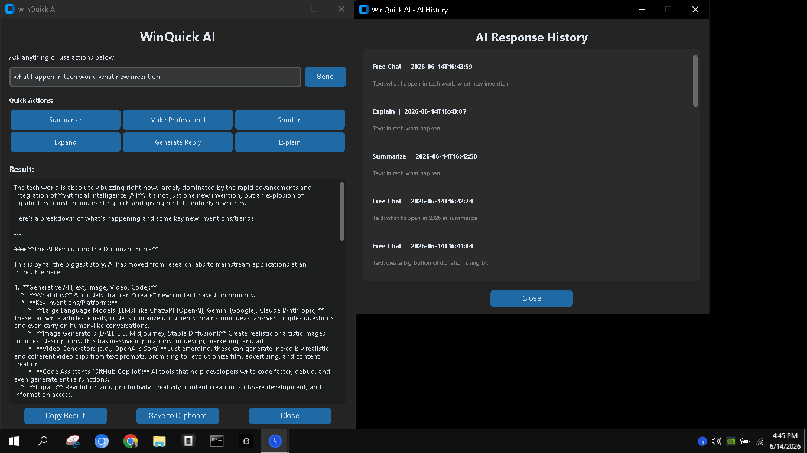

# WinQuick AI

> **AI at your fingertips.** Select any text anywhere in Windows, press `Ctrl+Shift+Z`, and get AI results instantly. No browser, no copy-paste, no sign-up.

Built with Python + CustomTkinter. Supports Gemini, OpenAI, and Claude — bring your own API key. Runs in your system tray, under 150MB RAM.

### 🚀 Features
- **6 AI Actions** — Summarize, Make Professional, Shorten, Expand, Generate Reply, Explain
- **Free Chat** — Ask AI anything, like a personal assistant
- **Clipboard History** — Auto-saves everything you copy for 30 days
- **Global Hotkey** — `Ctrl+Shift+Z` works in every Windows app
- **Any AI Provider** — Gemini, OpenAI, Claude, or custom API

### 📥 Download
[winquick.netlify.app](https://winquick.netlify.app/)

### 📄 License
MIT — free to use, modify, and share.
